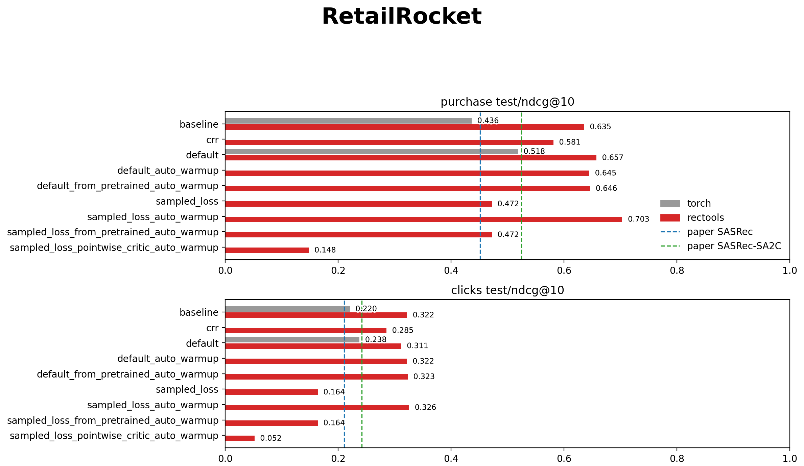
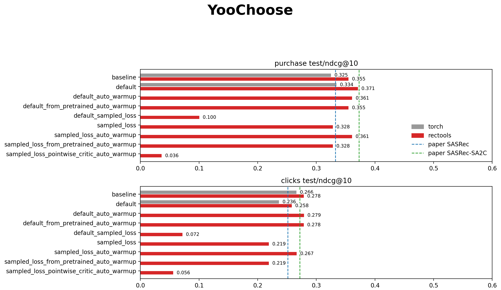
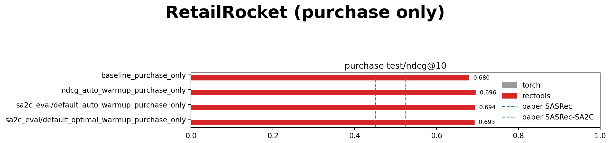
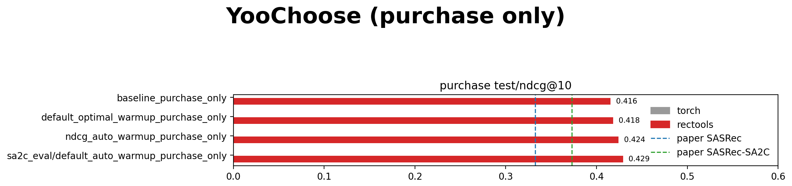

# RecSys Offline RL for e-commerce

This repo demonstrates Offline RL usage for Recommender System in e-commerce domain to optimize ranking metrics:
- Seq2Seq backbone SASRec based on [RecTools](https://github.com/MobileTeleSystems/RecTools);
- Actor-Critic RL architecture & training pipeline based on [**"Supervised Advantage Actor-Critic for Recommender Systems"**](https://arxiv.org/abs/2111.03474) paper.

The model is evaluated on following e-commerce datasets (click & purchase interactions):

- [**YooChoose**](https://www.kaggle.com/datasets/chadgostopp/recsys-challenge-2015);
- [**RetailRocket**](https://www.kaggle.com/datasets/retailrocket/ecommerce-dataset).

Additional ablations:
- Evaluate the model on purchase-only data;
- Evaluate RL training for a *ranking-based reward function* (NDCG-like).

## Offline RL pipeline overview
First, a replay buffer is constructed from user's logged data.

Then the model is trained in two stages:

(a) **Warmup stage** (SNQN algorithm): pretrain critic jointly with actor via a reward function;

(b) **Finetuning stage** (SA2C algorithm): regularize actor's policy with critic's Q-value estimates.

*The data is split into train/val/test in 80:10:10 ratio, metrics are reported for test split*


## Results

- [Clicks and purchases results](#clicks-and-purchases-results)
  - [RetailRocket (clicks & purchases)](#retailrocket-clicks--purchases)
  - [YooChoose (clicks & purchases)](#yoochoose-clicks--purchases)
- [Purchase-only results](#purchase-only-results)
  - [RetailRocket (purchase-only)](#retailrocket-purchase-only)
  - [YooChoose (purchase-only)](#yoochoose-purchase-only)

### Clicks and purchases results

#### RetailRocket (clicks + purchases)



#### YooChoose (clicks + purchases)



### Purchase-only results

#### RetailRocket (purchase-only)



#### YooChoose (purchase-only)




### Notes

For full list of commands to reproduce experiments refer to `COMMANDS.md`

Plots were generated by
```bash
python scripts/plot_test_results.py --max-metric-value 1.0 0.6 0.3
```
